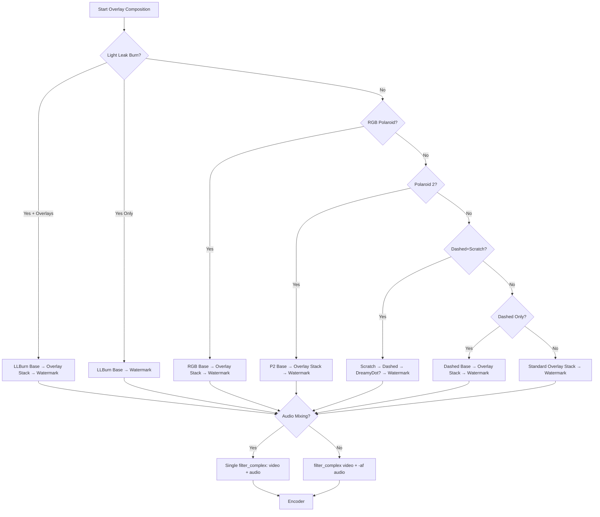
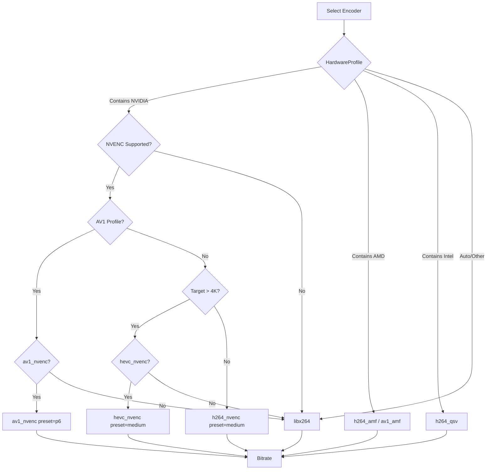
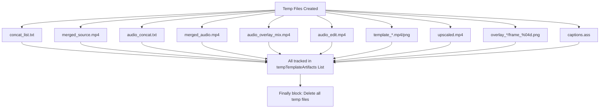
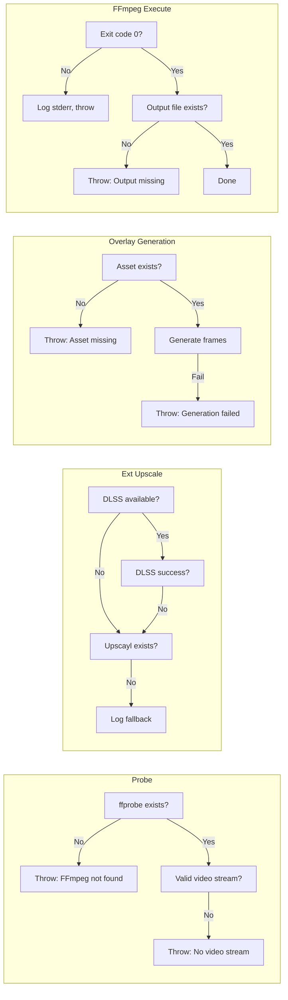

# TitanEngine Render Pipeline - Flow Diagram

## Complete Pipeline Overview (Mermaid)

```mermaid
flowchart TD
    %% ============ ENTRY POINT ============
    Start([ExecuteRenderAsync\nRenderJob job]) --> Init[EngineCore.Initialize\nFFmpeg/FFprobe/Upscayl/DLSS paths]

    %% ============ AUDIO PREP ============
    Init --> AudioPrep{Audio Processing}
    AudioPrep -->|MergeAudio| MergeAudio[MergeAudioToTempTrackAsync\nConcat N audio files]
    AudioPrep -->|SecondaryAudio| MixAudio[MixAudiosToTempTrackAsync\nTrack1 + Track2]
    AudioPrep -->|EditSegments| EditAudio[PrepareEditedAudioTrackAsync\nTrim/Volume/Speed]
    AudioPrep -->|CaptionSync| CaptionSync[GenerateCaptionSyncAssAsync\nWhisper AI → .ass]

    %% ============ VIDEO TIMELINE ============
    AudioPrep --> Timeline{Video Timeline}
    Timeline -->|MergeVideos| MergeVideo[MergeVideosToTempSourceAsync\nConcat + CrossTransitions]
    Timeline -->|LightLeakBurn| LLBTransition[LightLeakBurnPreset.RenderTransitionSourceAsync]
    Timeline -->|Template/Image| Template[BuildTemplateTimelineSourceAsync\nMagazine/Polaroid/ImageSeq]
    Timeline -->|Single| Direct[Use SourcePath directly]

    %% ============ EXTERNAL UPSCALE ============
    MergeVideo --> ExtUpscale{External AI Upscale?}
    LLBTransition --> ExtUpscale
    Template --> ExtUpscale
    Direct --> ExtUpscale
    ExtUpscale -->|UpscaleMode!=Off| TryDLSS[Try NGX DLVSR\nUpscaleWithNgxDlssAsync]
    ExtUpscale -->|UpscaleMode=Off| SkipExtUpscale
    TryDLSS -->|Success| UseExtUpscaled[Use upscaled video\nUpdate SourceW/H]
    TryDLSS -->|Fail| TryUpscayl[Try Upscayl\nUpscaleWithUpscaylAsync]
    TryUpscayl -->|Success| UseExtUpscaled
    TryUpscayl -->|Fail| FallbackInternal[Log fallback to internal]

    %% ============ FILTER CHAIN BUILD ============
    UseExtUpscaled --> FilterChain[Build Filter Chain]
    FallbackInternal --> FilterChain
    SkipExtUpscale --> FilterChain

    FilterChain --> Crop{Crop?}
    Crop -->|Yes| CropFilter[BuildCropFilter]
    Crop -->|No| ScaleUpscale

    ScaleUpscale{Internal Upscale?}
    ScaleUpscale -->|UpscaleMode!=Off| InternalUpscale[BuildAdvancedScaleFilter\nFSR/CAS/Anime4K]
    ScaleUpscale -->|Resolution!=Original| BasicScale[scale=W:H:flags=lanczos]
    ScaleUpscale -->|Crop+Original| ScaleBack[scale=targetW:targetH]
    ScaleUpscale -->|Original| NoScale

    %% ============ MOTION FX ============
    InternalUpscale --> MotionFX{Motion Effects}
    BasicScale --> MotionFX
    ScaleBack --> MotionFX
    NoScale --> MotionFX
    CropFilter --> MotionFX

    MotionFX -->|Enable60fps| Mintr[minterpolate=mi_mode=mci:fps=60]
    MotionFX -->|RsmbIntensity>0| TMix[tmix=frames=N]
    MotionFX -->|None| SkipMotion

    %% ============ FX EFFECTS ============
    SkipMotion --> FXEffects{FX Effects}
    Mintr --> FXEffects
    TMix --> FXEffects

    FXEffects -->|Light Leak| LLAsset[Asset-only via overlay]
    FXEffects -->|Light Leak Burn| LLBurn[Generated mask + overlay layers]
    FXEffects -->|Dust & Scratches| ScratchFX[Generated animated overlay]
    FXEffects -->|Cinematic Glow| GlowFX[BuildCinematicGlowFxFilter]
    FXEffects -->|Halo Glow| HaloFX[BuildHaloGlowFxFilter]
    FXEffects -->|Prism Light| PrismFX[BuildPrismLightFxFilter]
    FXEffects -->|Editorial Bloom| BloomFX[BuildEditorialBloomFxFilter]
    FXEffects -->|Flip Horizontal| HFlip[hflip]
    FXEffects -->|Polaroid| PolaroidFX[BuildPolaroidScrapbookFxFilter]
    FXEffects -->|Transition Recipe| TransRecipe[TransitionRecipeGraphBuilder]
    FXEffects -->|PostProcess Recipe| PostRecipe[PostProcessEffectGraphBuilder]
    FXEffects -->|None| SkipFX

    %% ============ COLOR GRADING ============
    SkipFX --> ColorGrade{Color Filter}
    GlowFX --> ColorGrade
    HaloFX --> ColorGrade
    PrismFX --> ColorGrade
    BloomFX --> ColorGrade
    PolaroidFX --> ColorGrade
    TransRecipe --> ColorGrade
    PostRecipe --> ColorGrade
    LLAsset --> ColorGrade
    LLBurn --> ColorGrade
    ScratchFX --> ColorGrade

    ColorGrade -->|ColorFilter!=None| ColorFilter[EngineCore.GetColorFilterCmd\n+ ScaleFilterIntensity]
    ColorGrade -->|None| SkipColor

    %% ============ TEXT/CAPTION ============
    SkipColor --> TextOverlay{Text/Caption}
    ColorFilter --> TextOverlay

    TextOverlay -->|TextOverlay| Typewriter[BuildTypewriterTextOverlay\nAesthetic/Static/Glow]
    TextOverlay -->|CaptionSync| AssFilter[ass=file.ass:fontsdir=Fonts]
    TextOverlay -->|None| SkipText

    %% ============ BRIGHTNESS/FADE ============
    SkipText --> Brightness[BuildBrightnessFilter]
    Typewriter --> Brightness
    AssFilter --> Brightness
    Brightness --> Fade[BuildFadeVideoFilter\nfade in/out]

    %% ============ OVERLAY COMPOSITION ============
    Fade --> OverlayComp{Overlay Composition\nComplex Filter Graph}

    %% Light Leak Burn + Overlays branch
    OverlayComp -->|LightLeakBurnEffect| LLBurnGraph[LightLeakBurn base graph\n+ overlay stack]
    OverlayComp -->|RGB Polaroid| RGBGraph[RGB Polaroid base\n+ overlay stack]
    OverlayComp -->|Polaroid Scrapbook 2| P2Graph[Polaroid2 base\n+ overlay stack]
    OverlayComp -->|Dashed+Scratch| DSGraph[Scratch → Dashed\n+ overlay stack]
    OverlayComp -->|Dashed Only| DGraph[Dashed base\n+ overlay stack]
    OverlayComp -->|Standard| StdGraph[Standard overlay stack]

    %% Overlay Stack (common)
    LLBurnGraph --> OverlayStack[Overlay Stack Sequence]
    RGBGraph --> OverlayStack
    P2Graph --> OverlayStack
    DSGraph --> OverlayStack
    DGraph --> OverlayStack
    StdGraph --> OverlayStack

    OverlayStack --> Particle[Particle Effect Recipe\nAppendOptionalRecipeParticleGraph]
    OverlayStack --> LightLeakAsset[Light Leak Overlay Asset\nAppendOptionalLightLeakAssetGraph]
    OverlayStack --> Rain[Rain Overlay\nAppendOptionalRainGraph]
    OverlayStack --> DreamyDot[Dreamy Dot Overlay\nAppendOptionalDreamyDotGraph]
    OverlayStack --> Scratch[Scratch Video\nAppendOptionalScratchGraph]
    OverlayStack --> Snowfall[Snowfall Multi-layer\nBuildSnowfallGraphChain]
    OverlayStack --> Watermark[Watermark + Brand Logo\nBuildWatermarkFilterComplex]

    %% ============ AUDIO FILTER GRAPH ============
    Watermark --> AudioGraph{Audio Mixing}
    AudioGraph -->|Source+External| MixBoth[amix=inputs=2:duration=shortest\nalimiter=limit=0.95]
    AudioGraph -->|Source Only| SourceOnly[Source audio filter chain]
    AudioGraph -->|External Only| ExtOnly[External audio filter chain]
    AudioGraph -->|None| NoAudio

    MixBoth --> AudioPost[BuildAudioPostProcessFilterChain\nLoudnorm/Volume]
    SourceOnly --> AudioPost
    ExtOnly --> AudioPost
    NoAudio --> SkipAudioPost

    AudioPost --> FinalMap{Output Mapping}
    SkipAudioPost --> FinalMap

    %% ============ ENCODING ============
    FinalMap --> EncoderSelect{Encoder Selection}
    EncoderSelect -->|NVIDIA+NVENC| H264NVENC[h264_nvenc preset=medium]
    EncoderSelect -->|NVIDIA+HEVC| HEVCNVENC[hevc_nvenc preset=medium]
    EncoderSelect -->|NVIDIA+AV1| AV1NVENC[av1_nvenc preset=p6]
    EncoderSelect -->|AMD| AMF[h264_amf/av1_amf preset=quality]
    EncoderSelect -->|Intel| QSV[h264_qsv preset=veryslow]
    EncoderSelect -->|CPU| LibX264[libx264 preset=veryslow CRF=16]

    H264NVENC --> Bitrate{Bitrate Strategy}
    HEVCNVENC --> Bitrate
    AV1NVENC --> Bitrate
    AMF --> Bitrate
    QSV --> Bitrate
    LibX264 --> Bitrate

    Bitrate -->|Match Source| MatchSource[-minrate 0.7x -maxrate 1.5x -bufsize 4x]
    Bitrate -->|Boost| Boost[-b:v 1.5x -minrate 0.8x -maxrate 1.3x -bufsize 2x]
    Bitrate -->|Custom| Custom[-b:v Custom -minrate 0.8x -maxrate 1.2x -bufsize 2x]

    MatchSource --> Output[Output: yuv420p MP4]
    Boost --> Output
    Custom --> Output

    Output --> Done([Job Complete\nResultPath set])
```



---

## Filter Chain Order (Critical)

```
INPUT VIDEO
    │
    ▼
[1] CROP (if enabled)
    │
    ▼
[2] SCALE / UPSCALE
    ├── External AI Upscale (DLSS/Upscayl) → SKIP internal
    ├── Internal: FSR / CAS / Anime4K shaders
    ├── Basic: scale=W:H:flags=lanczos
    └── Original: no scale (unless crop active)
    │
    ▼
[3] MOTION EFFECTS
    ├── 60fps: minterpolate (optical flow)
    └── RSMB: tmix (motion blur)
    │
    ▼
[4] FX EFFECTS (in order)
    ├── Flip Horizontal (hflip)
    ├── Cinematic Glow / Halo / Prism / Bloom (custom filter chains)
    ├── Polaroid Base Frame (if enabled)
    ├── Transition Recipe (motion pulse)
    ├── Post-Process Recipe (VHS, Glitch, Grain, CRT, etc.)
    └── Light Leak / Scratch → handled in overlay composition
    │
    ▼
[5] SLOW MOTION (setpts/atempo)
    │
    ▼
[6] COLOR GRADING (LUT-style curves, clamped for light FX compat)
    │
    ▼
[7] TEXT OVERLAYS
    ├── Typewriter (animated, aesthetic)
    ├── Caption Sync (ASS subtitles from Whisper)
    │
    ▼
[8] BRIGHTNESS (eq=brightness=X)
    │
    ▼
[9] FADE IN/OUT (fade=t=in/out)
    │
    ▼
[10] OVERLAY COMPOSITION (complex filter graph)
    ├── Light Leak Burn (base)
    ├── Scratch/Dust
    ├── Dreamy Dot
    ├── Particle Effects
    ├── RGB Polaroid LED
    ├── Polaroid Scrapbook 2
    ├── Dashed Polaroid
    ├── Snowfall (multi-layer)
    ├── Rain
    ├── Light Leak Overlay (asset)
    └── Watermark + Brand Logo (final)
    │
    ▼
[11] FORMAT: yuv420p
    │
    ▼
ENCODER (NVENC/AMF/QSV/libx264)
    │
    ▼
OUTPUT MP4
```

---

## Overlay Composition Branches (Decision Tree)



---

## Audio Pipeline Detail

```mermaid
flowchart LR
    subgraph SourceAudio[Source Video Audio]
        SA1[Input #0:a] --> SATrim[atrim/atrim]
        SATrim --> SAScale[atempo=SourceAudioSpeed]
        SAScale --> SAAudio[SourceAudioInputFilterChain]
    end

    subgraph ExternalAudio[External Audio Track(s)]
        EA1[Input #1:a] --> EATrim[atrim AudioTrimStart/Duration]
        EATrim --> EASpeed[atempo=ExternalAudioSpeed]
        EASpeed --> EAVol[volume=AudioVolume]
        EAVol --> EAAudio[ExternalAudioInputFilterChain]
    end

    subgraph Mixing[Audio Mixing]
        SAAudio --> Amix[amix=inputs=2:duration=shortest:normalize=0]
        EAAudio --> Amix
        Amix --> ALimiter[alimiter=limit=0.95]
        ALimiter --> AudioPost[AudioPostProcessFilterChain]
        AudioPost -->|Loudnorm| Loudnorm[loudnorm=I=-16:TP=-1.5:LRA=11]
        AudioPost -->|Volume| AVol[volume=AudioVolume]
        AVol --> AOut[audio_out]
        Loudnorm --> AOut
    end

    subgraph NoMix[No Mixing]
        SAAudio --> SAOut[Source audio only]
        EAAudio --> EAOut[External audio only]
    end
```

---

## Encoder Selection Logic



---

## Temp File Management



---

## Key Data Flow Summary

| Stage | Input | Output | Key Method |
|-------|-------|--------|------------|
| **Probe** | File path | Duration, Bitrate, W, H, FPS | `AnalyzeMediaDetailsAsync` |
| **Merge Video** | N video paths | 1 concat video | `MergeVideosToTempSourceAsync` |
| **Merge Audio** | N audio paths | 1 concat audio | `MergeAudiosToTempTrackAsync` |
| **Template** | Images + settings | Timeline video | `BuildTemplateTimelineSourceAsync` |
| **Ext Upscale** | Video | Upscaled video | `UpscaleWithNgxDlssAsync` / `UpscaleWithUpscaylAsync` |
| **Filter Graph** | Job settings | FFmpeg filter_complex | `ExecuteRenderAsync` (inline) |
| **Overlay Gen** | Recipe + dims | PNG sequences / MP4 | `*Preset.GenerateOverlayAsync` |
| **Encode** | Filter graph | Output MP4 | `RunFfmpegCaptureAsync` |

---

## Critical Constants & Limits

```csharp
// Filter chain limits
MAX_UPSCALE_FACTOR = 4x
MIN_DIMENSION = 2 (even)
MAX_FPS_INTERPOLATE = 60
RSMB_FRAMES_RANGE = 2..8 (based on intensity 0..1)
COLOR_INTENSITY_MAX = 1.0 (clamped 0.6 with light FX)
BRIGHTNESS_RANGE = -1.0 .. 1.0
VOLUME_RANGE = 0.0 .. 2.0
SLOW_MOTION_SPEED = 0.1 .. 8.0 (clamped)
AUDIO_TEMPO_CHAIN_MAX = 0.5 .. 2.0 per filter (chained)

// Bitrate minimums (Match Source)
1080p  → 8 Mbps
1440p  → 16 Mbps
4K     → 35 Mbps
8K     → 100 Mbps

// Encoder presets
NVENC_H264 = medium
NVENC_HEVC = medium  
NVENC_AV1 = p6
AMF = quality
QSV = veryslow
CPU = veryslow (CRF 16)
```

---

## Error Handling Checkpoints



---

## Performance Notes

| Aspect | Optimization |
|--------|--------------|
| **Overlay caching** | Particle/DreamyDot overlays cached by hash (width, height, fps, duration, params) |
| **External upscale** | Runs first, avoids internal upscale filter cost |
| **Filter graph** | Single complex filter_complex when possible (avoids re-encode passes) |
| **NVENC** | Zero-copy GPU path when available |
| **Temp files** | Written to `GetTitanTempDir()` (system temp), cleaned on completion |
| **Parallel** | Overlay generation runs async, but filter graph is sequential |

---

## Debugging Checkpoints (Log Prefixes)

| Prefix | Stage |
|--------|-------|
| `[OUTPUT]` | Output path decided |
| `[AUDIO-MERGE]` / `[AUDIO-OVERLAY]` / `[AUDIO-EDIT]` | Audio prep |
| `[TEMPLATE]` / `[TRANSITION]` / `[MERGE]` | Timeline building |
| `[PREPROCESSING]` | External upscale |
| `[ENCODER]` / `[ENCODER-NVENC]` / `[ENCODER-WARN]` | Encoder selection |
| `[FILTER-*]` | Each filter added to chain |
| `[FFMPEG-FILTER-COMPLEX]` / `[FFMPEG-COMBINED-FILTER-COMPLEX]` | Final filter graph |
| `[FFMPEG-MAP]` | Stream mapping |
| `[UPSCALE-AUTO]` | Auto resolution derivation |
| `[DLSS-NGX]` / `[DLSS-BUILD]` | DLSS backend |
| `[CAPTION-SYNC]` | Whisper AI captions |
| `[LIGHT-LEAK-BURN]` / `[SNOWFALL]` / `[RAIN]` / `[RGB-POLAROID]` etc | Overlay generation |